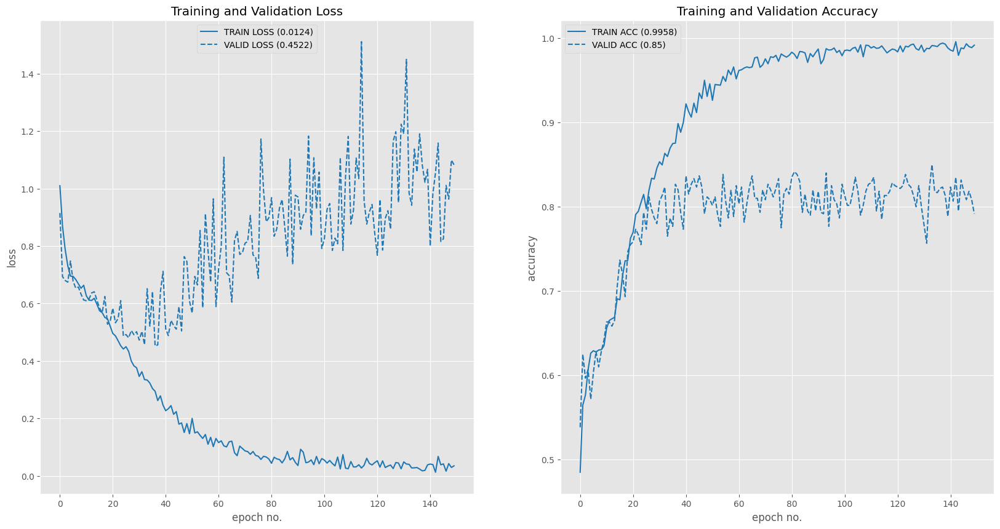
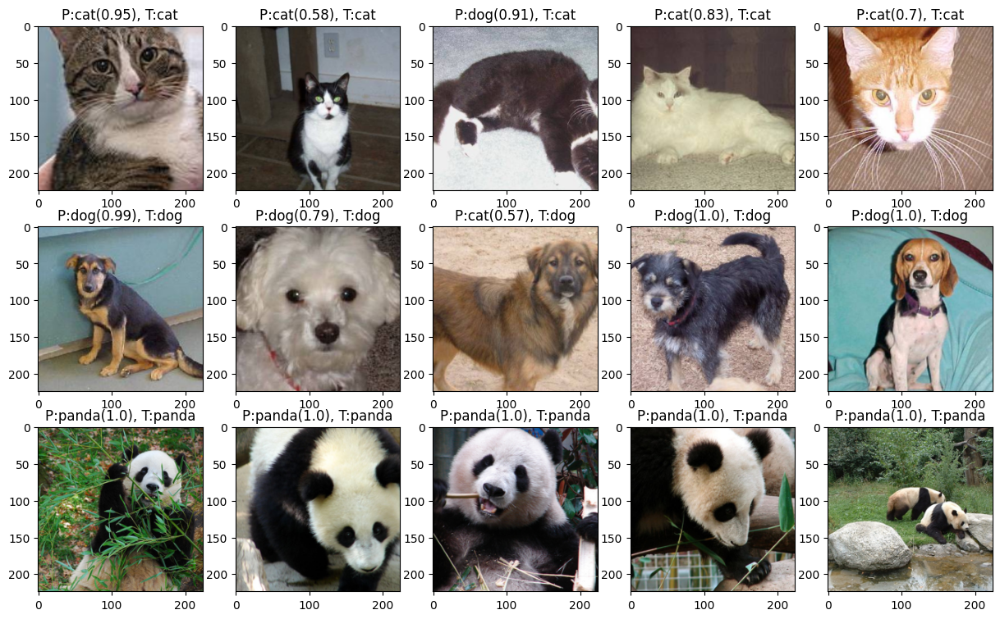
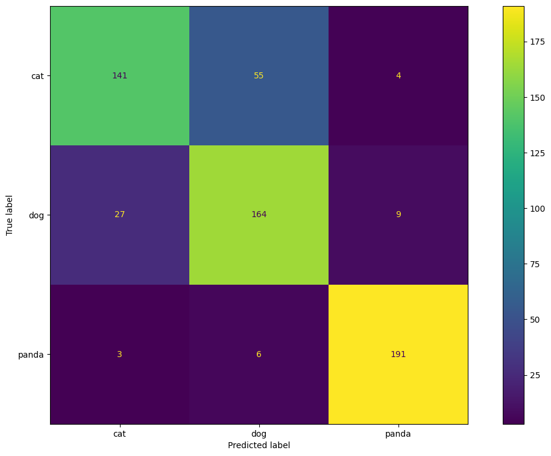

<p align="center">
  
  
</p>


## Documentation

- [Pytorch](https://pytorch.org/docs/stable/index.html)
- [OpenCV](https://docs.opencv.org/4.x/d1/dfb/intro.html)
- [Pandas](https://pandas.pydata.org/docs/index.html)
- [sklearn](https://scikit-learn.org/stable/user_guide.html)

# <font style="color:blue">Project 1: Implement a CNN-Based Image Classifier</font>

Earlier, you trained CNNs on datasets of small images that were available inside torchvision. For example,  MNIST, FashionMNIST and CIFAR10 . Though a good starting point, with, these assignments lacked the complexity to tackle  real-world problems. Also, you were given most of the code and only had to add  small parts to  complete the assignment.

In this project, you will write most of the code yourself ( just refer to all the course lessons and the code we have shared).


### <font style="color:green">Task </font>

**Implement a `3-class` Image Classifier, using a CNN**, on a dataset, which consists of `1000` images each of **panda, cat and dog**. We took the  dataset from [Kaggle](https://www.kaggle.com/ashishsaxena2209/animal-image-datasetdog-cat-and-panda), ande split it into `80:20` ratio for `train:validation`. To download, [**click here**](https://www.dropbox.com/sh/n5nya3g3airlub6/AACi7vaUjdTA0t2j_iKWgp4Ra?dl=1).


#### <font style = "color:rgb(200,0,0)">Build your own network. Do not use any pre-trained network/weights for this task.</font>

### <font style="color:green">The Purpose of This Project is Two-fold:</font>

1. The first is to get your hands dirty. training a neural network from scratch. Only then will you you understand how to build and train a real network on real data. You will implement everything this time - right from getting the data to analysing the final results.


2. The second is to reinforce the use of the complete training pipeline that we suggested in our previous lecture.Try to stick to this pipeline every time you work on a new problem.


## Sections and Goals

**Sections**
- Step 1 - Understand your problem
- Step 2A - Get the data
- Step 2B - Explore and understand your data
- Step 2C - Create a sample data from the dataset
- Step 3 - Data preparation
- Step 4 - Train a simple model on sample data and check the pipeline before proceeding to train the full network
- Step 5 - Train on full data
- Step 6 - Improve your model


**Goal**

You have to train a network on the full data. Experiment with different network parameters to **achieve `>85%` validation accuracy**. You may not get `85% `on your first attempt. To achieve that, experiment with:

- Number of layers
- Parameters inside the layers
- Optimizers and learning rate schedulers [You can even get good results without a learning rate scheduler]
- Regularization techniques like Data augmentation, Dropout, BatchNorm
- Number of epochs

## Model Architecture

### Body and Head

The body of the model consists of a sequential stack of convolutional layers, batch normalization, ReLU activation, max-pooling, and dropout. The convolutional layers have varying kernel sizes and strides to capture different features from the input data.

The head of the model is another sequential stack consisting of linear layers, ReLU activation, and dropout. The linear layers reduce the dimensionality of the input data towards the final output layer.

```python
MyModel(
  (_body): Sequential(
    (0): Conv2d(3, 18, kernel_size=(5, 5), stride=(1, 1))
    (1): BatchNorm2d(18, eps=1e-05, momentum=0.1, affine=True, track_running_stats=True)
    (2): ReLU(inplace=True)
    (3): MaxPool2d(kernel_size=2, stride=2, padding=0, dilation=1, ceil_mode=False)
    (4): Conv2d(18, 54, kernel_size=(5, 5), stride=(1, 1))
    (5): BatchNorm2d(54, eps=1e-05, momentum=0.1, affine=True, track_running_stats=True)
    (6): ReLU(inplace=True)
    (7): MaxPool2d(kernel_size=2, stride=2, padding=0, dilation=1, ceil_mode=False)
    (8): Conv2d(54, 162, kernel_size=(2, 2), stride=(1, 1), padding=(1, 1))
    (9): BatchNorm2d(162, eps=1e-05, momentum=0.1, affine=True, track_running_stats=True)
    (10): ReLU(inplace=True)
    (11): MaxPool2d(kernel_size=2, stride=2, padding=0, dilation=1, ceil_mode=False)
    (12): Conv2d(162, 324, kernel_size=(5, 5), stride=(1, 1))
    (13): BatchNorm2d(324, eps=1e-05, momentum=0.1, affine=True, track_running_stats=True)
    (14): ReLU(inplace=True)
    (15): MaxPool2d(kernel_size=2, stride=2, padding=0, dilation=1, ceil_mode=False)
    (16): Dropout(p=0.25, inplace=False)
  )
  (_head): Sequential(
    (0): Linear(in_features=39204, out_features=2048, bias=True)
    (1): ReLU(inplace=True)
    (2): Dropout(p=0.25, inplace=False)
    (3): Linear(in_features=2048, out_features=1024, bias=True)
    ...
    (21): Linear(in_features=40, out_features=3, bias=True)
  )
)
```
    
## Results

The model was trained with the following configuration for system and training

```python

class SystemConfiguration:
    '''
    Describes the common system setting needed for reproducible training
    '''
    seed: int = 21  # seed number to set the state of all random number generators
    cudnn_benchmark_enabled: bool = True  # enable CuDNN benchmark for the sake of performance
    cudnn_deterministic: bool = True  # make cudnn deterministic (reproducible training)

class TrainingConfiguration:
    '''
    Describes configuration of the training process
    '''
    batch_size: int = 32
    epochs_count: int = 150
    init_learning_rate: float = 0.0001  # initial learning rate for lr scheduler
    log_interval: int = 5
    test_interval: int = 1
    data_root: str = "./cat-dog-panda"
    num_workers: int = 2
    device: str = 'cuda'

```

### Loss and accuracy plot


### Predictions and Target plot


### Confusion Matrix Results
